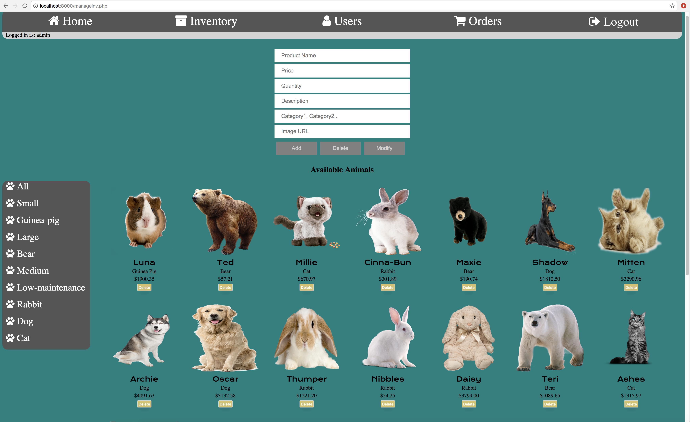

# 42 Project: rush00 for the PHP piscine

Simple e-commerce website facilitating the sale of exotic and personable animals. 

The entire project was created in a single weekend utilizing CSS, HTML, and PHP.

The site is not currently hosted anywhere, but can be run locally by using php -S localhost:<port> in the main directory of the project.

